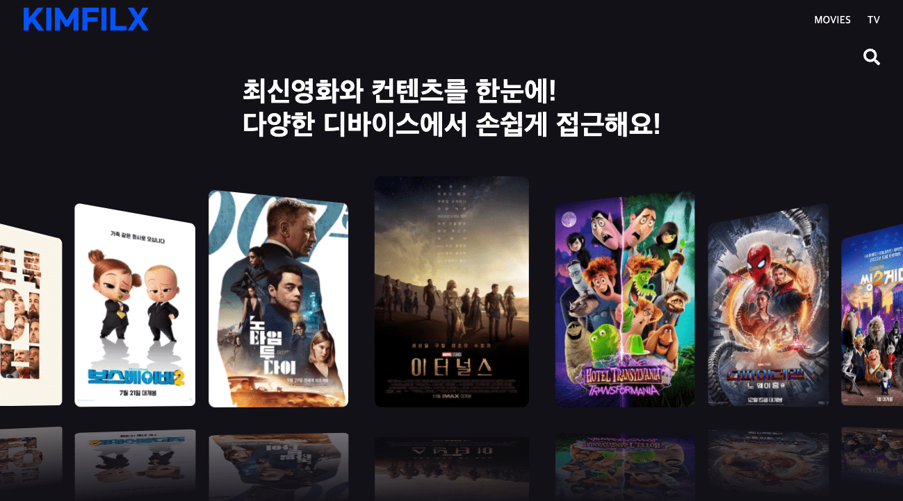
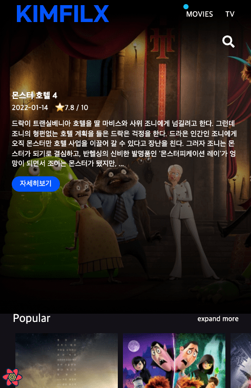
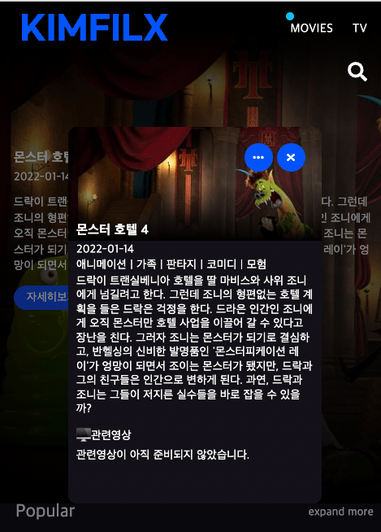
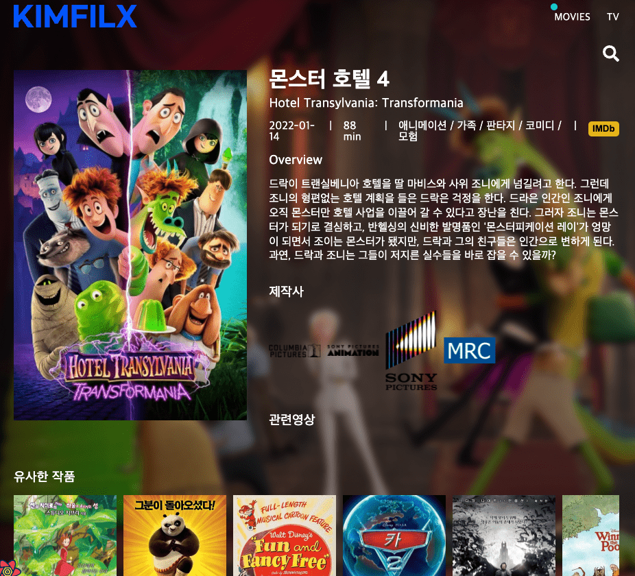
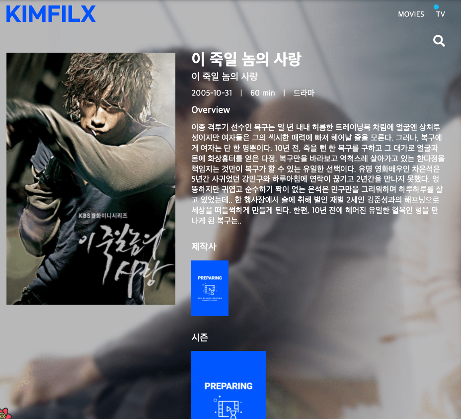

# Kimflix

the movie api를 사용한 react page 입니다.

## 주요컨셉

> - style component ( theme )
> - react router
> - react query
> - framer motion

## Router Screen

---

- [x] HOME
- [x] TV SHOW
- [x] SEARCH
- [x] Detail

## API verb

- movie
  - nowPlaying : 현재 상영중 가져오기
  - upComing : 상영예정 가져오기
  - popular : 인기영화 가져오기
  - movieSimilar : 비슷한 영화 가져오기
  - getmovie : 세부정보 가져오기
- tv

  - topRated : 평점높은순
  - popular : 인기작 가져오기
  - airingToday : 오늘방영중
  - getTv : 세부정보 가져오기
  - tvSimilar : 유사한 프로그램 가져오기

- search
  - multi : 인물 / 영화 / tv query 검색결과

## 주요기능

---

### 1. 메인

- swiper slide로 movie popular 데이터로 렌더링



### 2. 영화 / TV 탭

- framer motion으로 슬라이드 드래그 기능 구현
- 첫번째 슬라이드와 배경화면 연결해서 mouse 올릴 때마다 banner의 src가 변하게 만듦



### 3. 팝업

- 각 포스터를 클릭했을 때 팝업이 나옴
- 세부페이지로 링크버튼, 닫기버튼
- 관련유튜브 영상이 하단부에 렌더링

  

### 4. 세부페이지

- api 정보를 받아서 기본 정보 노출
- 비슷한 영화 motion slider drag 가능
- 비슷한 영화 클릭시 해당 영화 세부페이지로 이동

  

### 5. 404 이미지

- 404 이미지만들어서 이미지 없을 경우 onError로 렌더링

  

---

## 느낀점

[styled-components]

- JS in CSS , 컴포넌트 형식으로 개발을 해나갈때 코드량을 줄일 수 있었음.

- ts + theme의 조합은 style을 더 빠르게 만들어 줬고, 반응형 개발시 더 효과적으로 작업이 가능하게 되었음.

[react query]

- useState, useEffect 으로 사용되는 비동기 코드를 단 한줄로 합쳐버림. 로딩, 리패칭, 페이징할때 너무 간편하게 사용했음.

- react query dev툴로 캐싱을 더 잘 확인할 수 있었음. 캐싱으로 요청은 줄고 속도는 더 빨라짐.

- useInfinity query + intersection observe 로 무한스크롤 구현이 간편해졌음.

```ts
const {
  data: listData,
  fetchNextPage,
  hasNextPage,
  isLoading,
} = useInfiniteQuery(
  [isMovie ? "movies" : "tv", "list", category],
  ({ pageParam = 1 }) => getApi(category)(pageParam),
  {
    getNextPageParam: (lastpage, page) => {
      if (lastpage.total_pages > lastpage.page) {
        return lastpage.page + 1;
      } else {
        return;
      }
    },
  }
);
```
